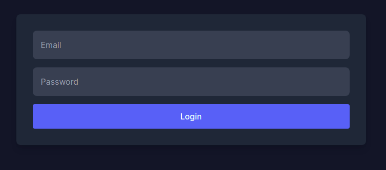
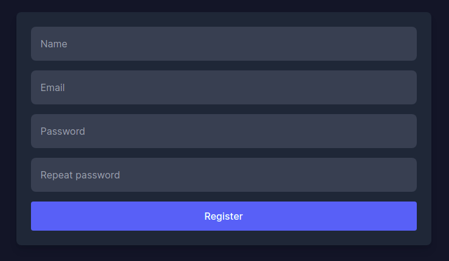
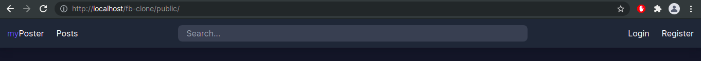
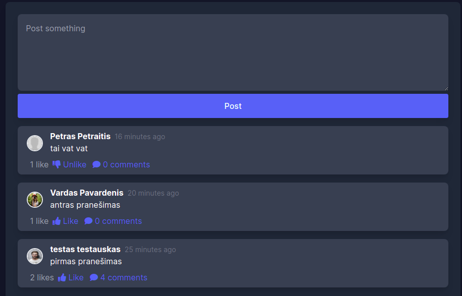
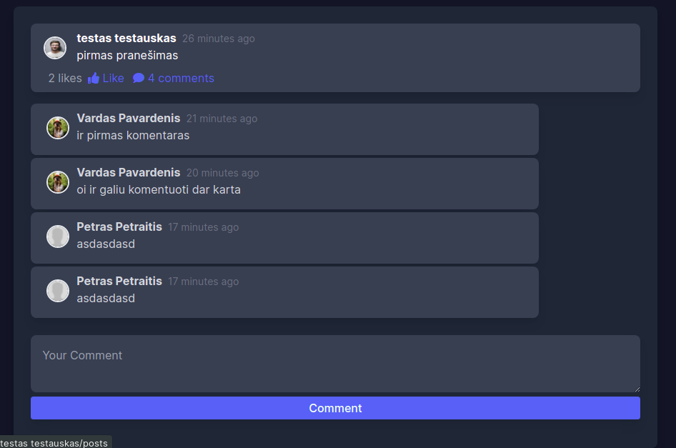
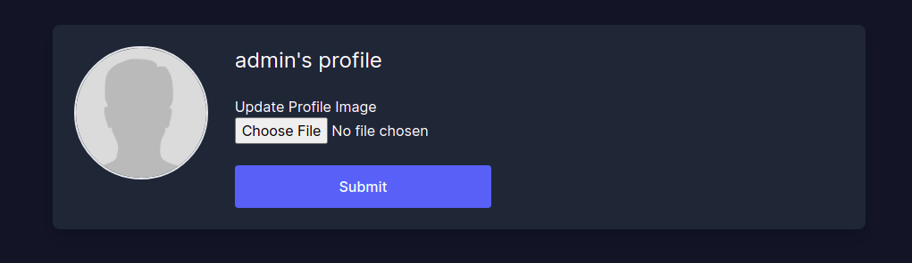

myPoster is an facebook clone 0.1. Our goal is to help people find eachother, and share thoughts simpler.  

### Installation

```bash
Import the database from file (navigate to directory fb-clone/db, file name: fb-clone.sql)  
Clone this repository into htdocs folder (if using xampp/netbeans, the location is: xampp/htdocs/fb-clone
link to open: http://localhost/fb-clone/public
```

### Usage

Login or Create account



#### Register



#### Navigate

Navigate application



#### manage Posts

Create post, See other posts, like it, edit it, or delete it



#### comment on a post

open chosen post and comment on it



#### update profile

upload your own picture


